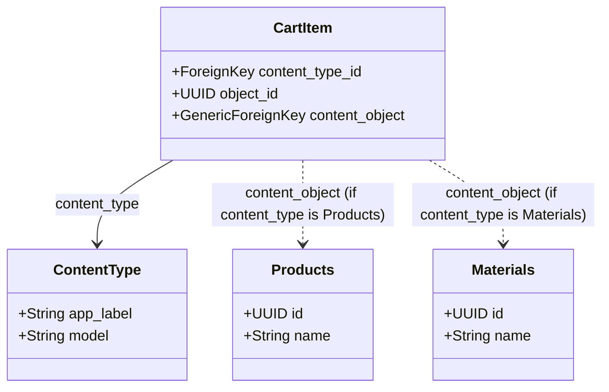
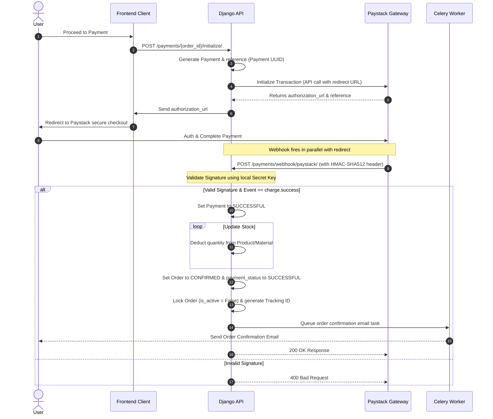
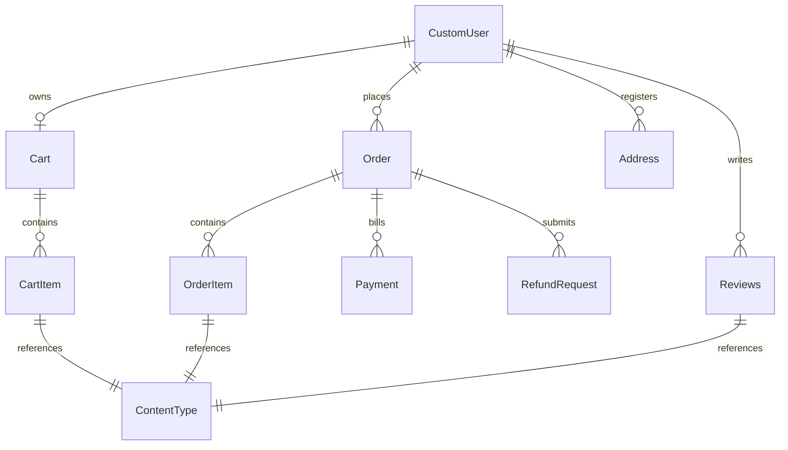

# Marvelam Backend Architecture & Technical Documentation

Welcome to **Marvelam**, a production-grade, highly scalable e-commerce backend platform built using **Django** and **Django REST Framework (DRF)**. This system is designed following modern architectural patterns of large-scale retail systems (similar to Jumia, Konga, and Amazon) to handle high transaction volumes, complex product catalogs, dynamic cart operations, secure payments, and asynchronous processing.

---

## 1. Project Overview

### 1.1 Purpose & Vision
Marvelam is engineered to bridge the gap between traditional retail products and bespoke manufacturing. The platform supports a **dual-catalog architecture** hosting both pre-manufactured **Products** and raw/customizable **Materials**. The core technical objective is to deliver a robust, secure, and low-latency API platform that scales seamlessly, ensures high data integrity, and provides deep customization capabilities for cart items.

### 1.2 Target Audience & Market
Marvelam serves a double-sided market:
*   **Retail Customers:** Consumers seeking off-the-shelf finished goods (Products).
*   **Bespoke Creators & Designers:** Users sourcing specific raw materials (Materials) with precise measurements, custom colors, or specific parameters for tailors and fashion designers.

---

## 2. Tech Stack

The technology stack is carefully selected to guarantee compliance with enterprise security, rapid development, and asynchronous task offloading:

| Technology | Version | Purpose |
| :--- | :--- | :--- |
| **Python** | `3.12+` | Runtime environment |
| **Django** | `6.0` | Core web framework |
| **Django REST Framework** | `3.16.1` | REST API construction, serialization, and view layers |
| **SimpleJWT** | `5.5.1` | Stateless authentication via JWT (JSON Web Tokens) |
| **Celery** | `5.6.2` | Distributed asynchronous task queue |
| **Redis** | `6.4.0` | In-memory message broker for Celery and caching layer |
| **Paystack API (Python)** | `2.1.3` | Core payment gateway SDK for Africa's leading payment gateway |
| **SQLite / PostgreSQL** | `Development / Production` | Relational database backend for transactional integrity |
| **Phonenumber Field** | `8.4.0` | E.164 standard international phone number validation |
| **Django Allauth** | `65.13.1` | Social authentication integration (Google, Facebook) |

---

## 3. Project Structure

Marvelam is organized using a domain-driven architectural pattern where each application represents a decoupled subdomain. This layout facilitates parallel feature development, localizes dependencies, and simplifies future microservice extraction.

```text
Marvelam/
│
├── MAC/                        # Root Project Directory (Configuration)
│   ├── __init__.py
│   ├── asgi.py                 # ASGI entry point for async protocol servers
│   ├── celery.py               # Celery worker initialization
│   ├── settings.py             # Global settings (decoupled via python-decouple)
│   ├── urls.py                 # Primary routing directory
│   └── wsgi.py                 # WSGI entry point for standard web servers
│
├── accounts/                   # Identity & Access Management (IAM)
│   ├── utils/                  # Password strength and validator utilities
│   ├── models.py               # CustomUser with UUID, integrated profiles
│   ├── serializers.py          # Custom JWT & profile updates
│   ├── tasks.py                # Asynchronous user welcome & password reset emails
│   └── views.py                # Authentication and profile views
│
├── products/                   # Catalog: Ready-made Products
│   ├── models.py               # Products model inheriting from CatalogBaseModel
│   ├── serializers.py          # Product detail and listing serializers
│   └── views.py                # Viewsets for product catalogs and similar items
│
├── materials/                  # Catalog: Customizable Raw Materials
│   ├── models.py               # Materials model with custom color & stock logic
│   ├── serializers.py          # Material serializers
│   └── views.py                # Material CRUD endpoints
│
├── cart/                       # Active Cart Management
│   ├── models.py               # Cart & CartItem models (GenericForeignKey driven)
│   ├── serializers.py          # Cart item calculation serializers
│   └── views.py                # Dynamic add/update/remove cart endpoints
│
├── order/                      # Order & Fulfillment Engine
│   ├── models.py               # Orders, OrderItems, Addresses, and Delivery Methods
│   ├── tasks.py                # Email tasks for order confirmation/updates
│   └── views.py                # Order placement, checkout preview, and address books
│
├── payments/                   # Financial Transactions & Gateways
│   ├── models.py               # Payments and RefundRequest trackers
│   ├── tasks.py                # Asynchronous Celery refund email dispatchers
│   ├── views.py                # Paystack initialize, callback, webhook, and refunds
│   └── signals.py              # Signal configurations
│
├── review/                     # Feedback & Reputation Management
│   ├── models.py               # Reviews (GenericForeignKey to Product/Material)
│   ├── serializers.py          # Verified purchase validator serializers
│   └── views.py                # Review lists, creations, updates, and deletes
│
├── templates/                  # Base HTML email layouts
├── static/                     # Static media files (CSS, JS)
├── db.sqlite3                  # Development database
├── requirements.txt            # Package dependencies list
├── .env                        # Decoupled environment secrets configuration
├── run.bat                     # Runserver utility script
└── update.bat                  # Migration helper batch file
```

---

## 4. Key Features

1.  **Dual-Catalog Polymorphism:** Supports both `Products` and `Materials` using a single abstraction layer for reviews, shopping carts, and order items.
2.  **Stateless JWT Security:** Authentication is completely stateless, secured using SimpleJWT with blacklisting upon token rotation or logout.
3.  **Comprehensive Address Book:** Standardized user delivery addresses containing default-address flags that auto-reset other addresses to preserve a single default destination.
4.  **Advanced Cart Calculations:** Dynamic computation of sub-totals, discount rates, and overall totals directly compiled in the DB using clean Django ORM aggregates.
5.  **Smart Business Days Estimation:** A customized business-day calculator that skips weekends to predict delivery dates based on standard, express, or premium delivery plans.
6.  **Paystack Webhook Verification:** Full security handshake validating webhook signatures via HMAC-SHA512 prior to processing payments and adjusting stock.
7.  **Asynchronous Tasks (Celery + Redis):** All user activations, order confirmations, status changes, and refund notifications are offloaded to background Celery workers to keep API request-response cycles extremely fast.
8.  **Verified Purchase Lock:** A review gatekeeper preventing users from reviewing a product unless they have successfully completed an order containing that item.

---

## 5. Architecture & Design Decisions

### 5.1 GenericForeignKey for CartItem and OrderItem
In a standard database design, to associate items in a Cart or Order with actual products, one uses a Foreign Key to the Product table. However, Marvelam hosts two completely different inventory types stored in separate tables: `Products` and `Materials`. 

To avoid creating duplicate schemas (e.g., `ProductCartItem` and `MaterialCartItem`) or having multiple nullable Foreign Keys (`product_id` and `material_id`) on a single item row, we implemented **Django ContentTypes and Generic Foreign Keys**.



**Technical Benefits:**
*   **Extensibility:** If the system introduces a new inventory model in the future (e.g., `SartorialStyles` or `Accessories`), no database migration is required for `CartItem` or `OrderItem`. We simply register the new model and link it using the content type.
*   **Database Cleanliness:** Eliminates sparse tables containing dozens of null columns.

---

### 5.2 CustomUser Model Design
Django's default `User` model uses an auto-incrementing integer key and relies on a separate `UserProfile` table to store metadata (like address, country, phone). In high-volume e-commerce applications, this pattern leads to frequent SQL `JOIN` statements and introduces vulnerability to User enumeration attacks.

Marvelam overcomes this by implementing a unified **`CustomUser`** model extending `AbstractUser`:

```python
class CustomUser(AbstractUser):
    id = models.UUIDField(primary_key=True, default=uuid.uuid4, editable=False)
    phone = PhoneNumberField()
    email = models.EmailField(max_length=500, unique=True)
    gender = models.CharField(choices=GENDER_CATEGORY)
    
    # Profile fields merged into User model to eliminate JOINs
    country = models.CharField(max_length=500, null=True, blank=True)
    state = models.CharField(max_length=200, null=True, blank=True)
    city = models.CharField(max_length=500, null=True, blank=True)
    address = models.TextField(max_length=1000, null=True, blank=True)
    profile_image = models.ImageField(upload_to=image_path, null=True, blank=True)
```

**Architectural Rationale:**
1.  **UUID Primary Keys:** Hides the total volume of registered users from malicious actors and prevents sequence prediction attacks.
2.  **No UserProfile JOINs:** Fetching a user's address for delivery calculations is performed in a single query since the fields are local to the user table.
3.  **Email-First Authentication:** The user's unique `email` is designated as the `USERNAME_FIELD` to match modern e-commerce login expectations.

---

### 5.3 Polymorphic Design for Products and Materials
To maintain common attributes (pricing, descriptions, discount percentages, images, slugs, and timestamps) without duplicating columns across multiple models, we designed an inheritance tree using abstract models:

```python
class TimeStampModel(models.Model):
    created_at = models.DateTimeField(auto_now_add=True)
    updatred_at = models.DateTimeField(auto_now=True)  # Database audit trail

    class Meta:
        abstract = True

class CatalogBaseModel(TimeStampModel):
    name = models.CharField(max_length=255)
    description = models.TextField(max_length=500)
    price = models.DecimalField(max_digits=10, decimal_places=2)
    discount = models.DecimalField(max_digits=10, decimal_places=2, default=0.00)
    image = models.ImageField(upload_to=image_path, null=True, blank=True)
    slug = models.SlugField(unique=True, blank=True)

    class Meta:
        abstract = True
```

Both `Products` and `Materials` inherit from `CatalogBaseModel`. `Materials` defines its own domain-specific attribute `color`, whereas `Products` implements categorical recommendation logic. 

**Auto-Status & Stock Logic:**
When products or materials are saved, the system checks the current stock. If stock reaches zero, it automatically deactivates the item:
```python
def save(self, *args, **kwargs):
    if self.stock <= 0:
        self.is_active = False 
    elif self.stock > 0:
        self.is_active = True 
    self.slug = slugify(self.name)
    super().save(*args, **kwargs)
```

---

### 5.4 Payment Integration (Paystack + Webhook Flow)
E-commerce payment flows must be resilient against browser interruptions, closed tabs, and payment callback drops. Marvelam addresses this by combining synchronous client initialization with asynchronous webhook processing.



**Signature Verification Security:**
```python
request_body = request.body
secret = settings.PAYSTACK_SECRET_KEY.encode()
signature = request.headers.get('x-paystack-signature')
expected_signature = hmac.new(secret, request_body, hashlib.sha512).hexdigest()

if signature != expected_signature:
    return HttpResponse(status=400)
```

---

### 5.5 Review System with Verified Purchase Logic
To protect the marketplace from spam reviews and fake positive ratings, Marvelam implements a strict review validator. A user is only permitted to write a review for a specific product or material if they have purchased it, the payment succeeded, the order was delivered, and the transaction is closed.

**Validation Rules in Serializer:**
```python
content_type = ContentType.objects.get_for_model(model_class)

has_permission = OrderItem.objects.filter(
    order__user=user,
    object_id=item_id,
    content_type=content_type,
    order__status='COMPLETED',
    order__is_active=False
).exists()

if not has_permission:
    raise serializers.ValidationError('You can only review items you have purchased and received.')
```

---

## 6. Database Models

The database maintains strict integrity rules, cascading logic, and audit trails.



### 6.1 Critical Relationships
*   **CustomUser & Cart:** `OneToOne` relationship. A user can only have one active cart.
*   **Cart & CartItem:** `ForeignKey` with `related_name='items'`. If a Cart is deleted, its CartItems are cascade-deleted.
*   **Order & OrderItem:** `ForeignKey` with `related_name='orderitems'`. Deleting an order item triggers recalculation of order totals.
*   **ContentType Relations:** `CartItem`, `OrderItem`, and `Reviews` all link to product tables polymorphically using:
    *   `content_type = models.ForeignKey(ContentType, on_delete=models.PROTECT)`
    *   `object_id = models.UUIDField()`
    *   `content_object = GenericForeignKey('content_type', 'object_id')`

---

## 7. API Design & Endpoints

> [!NOTE]
> Detailed JSON response payloads, headers, and parameter definitions are documented inside the interactive **Swagger/Redoc** interfaces at `/swagger/` or `/redoc/`.

Below is a high-level catalog of core endpoints exposed by the API:

### 7.1 Authentication & Profile (`/api/`)
*   `POST /api/register/` - Create a new customer profile.
*   `POST /api/login/` - Obtain a JWT access/refresh token pair.
*   `GET /api/verify_email/<user_id>/<verification_token>/` - Email verification link landing view.
*   `POST /api/password_reset/` - Request a password reset.
*   `POST /api/password_reset/<user_id>/<token>/` - Confirm password reset.
*   `POST /api/logout/` - Blacklist refresh tokens.
*   `POST /api/token/refresh/` - Rotate expired access tokens.
*   `GET /api/profile/<uuid:pk>/` - Fetch profile metadata.
*   `PUT /api/update_profile/<uuid:pk>/` - Update profile addresses or image.
*   `PUT /api/update_password/<uuid:pk>/` - Securely change password credentials.

### 7.2 Catalogs (`/products/` & `/materials/`)
*   `GET /products/list/` - List products with filter queries.
*   `POST /products/create/` - Add products (Staff authorization required).
*   `GET /products/<slug>/<uuid:pk>/` - View single product.
*   `PUT /products/<slug>/<uuid:pk>/update/` - Update product fields.
*   `DELETE /products/<slug>/<uuid:pk>/delete/` - Remove product from catalog.
*   `GET /materials/list/` - List fabrics and materials.
*   `POST /materials/create/` - Create raw materials.

### 7.3 Shopping Cart (`/cart/`)
*   `GET /cart/` - Fetch active user cart details and aggregated sub-totals.
*   `POST /cart/add/` - Add an item (Products/Materials) to the cart using content-type parameters.
*   `PATCH /cart/<id>/update/` - Change item quantity.
*   `DELETE /cart/<id>/remove/` - Remove item from cart.

### 7.4 Orders & Checkout (`/order/` / `/checkout/`)
*   `GET /order/preview/` - Show prices, estimated shipping dates, and discounts prior to confirmation.
*   `POST /order/address/create/` - Save delivery addresses.
*   `POST /order/place_order/` - Convert active Cart items into an unpaid Order.
*   `GET /order/lists/` - Fetch user order history.
*   `GET /order/<uuid:pk>/` - View single order details with item list and delivery methods.

### 7.5 Payments & Webhooks (`/payments/`)
*   `POST /payments/<uuid:order_id>/initialize/` - Kickoff transaction sequence with Paystack.
*   `GET /payments/callback/` - Redirect landing target to verify transaction references.
*   `POST /payments/webhook/paystack/` - Public webhook listener validating payments, adjusting stock, and sending confirmation emails.
*   `POST /payments/refund/<uuid:order_id>/create/` - File return request for delivered orders.
*   `PATCH /payments/refund/<id>/update/` - Review return requests (Staff authorization required).

---

## 8. Setup & Installation Guide

### Prerequisites
*   **Python:** 3.12 or higher
*   **Redis Server:** Running locally on port `6379` (Required for Celery)
*   **Pip:** python package installer

### 8.1 Clone & Virtual Environment setup
```powershell
# Clone the repository
git clone <repository_url> Marvelam
cd Marvelam

# Create a virtual environment
python -m venv venv

# Activate virtual environment (Windows Powershell)
.\venv\Scripts\Activate.ps1
```

### 8.2 Dependency Installation
```powershell
pip install -r requirements.txt
```

### 8.3 Database Setup
Ensure that your environment variables are configured in a `.env` file first (refer to Section 9). Run migrations to setup sqlite:
```powershell
# Create database tables
python manage.py makemigrations
python manage.py migrate

# Create administrative staff account
python manage.py createsuperuser
```

### 8.4 Start the Services

#### A. Run Django REST API Server
```powershell
python manage.py runserver
```

#### B. Start Redis Server
Ensure your Redis service is started. On Windows, this is typically run via Docker or WSL:
```bash
redis-server
```

#### C. Start Celery Asynchronous Workers
Because Windows does not support process forking, Celery workers must run in `solo` or `threads` pool mode:
```powershell
celery -A MAC worker --loglevel=info -P solo
```

#### D. Start Celery Beat Scheduler (For cron tasks)
```powershell
celery -A MAC beat -l info
```

---

## 9. Environment Variables

Create a file named `.env` in the root folder (alongside `manage.py`) containing the variables listed below:

```ini
# Core Configuration
DEBUG=True
SECRET_KEY=your_django_secret_key_here

# Third-Party Social Auth Keys
SOCIAL_AUTH_GOOGLE_OAUTH2_KEY=your_google_client_id
SOCIAL_AUTH_GOOGLE_OAUTH2_SECRET=your_google_client_secret
SOCIAL_AUTH_FACEBOOK_KEY=your_facebook_app_id
SOCIAL_AUTH_FACEBOOK_SECRET=your_facebook_app_secret

# Dynamic SMTP Email Configuration
EMAIL_BACKEND=django.core.mail.backends.smtp.EmailBackend
EMAIL_HOST=smtp.sendgrid.net
EMAIL_PORT=587
EMAIL_USE_TLS=True
EMAIL_HOST_USER=apikey
EMAIL_HOST_PASSWORD=your_sendgrid_api_key_or_smtp_password
DEFAULT_FROM_EMAIL=your_verified_sender_email@domain.com

# Paystack API Keys
PAYSTACK_SECRET_KEY=sk_test_your_secret_key_here
PAYSTACK_PUBLIC_KEY=pk_test_your_public_key_here
```

---

## 10. Deployment Considerations

To transition Marvelam to a production environment (such as AWS, Heroku, or GCP), implement the following deployment plan:

1.  **Environment Settings:** Change `DEBUG=False` in your production environment variables. Set `ALLOWED_HOSTS` to your production domain name instead of wildcards (`*`).
2.  **Database Migration:** Swap SQLite for a managed PostgreSQL database service (e.g., AWS RDS or Heroku Postgres) for scaling connection pools.
3.  **Production WSGI/ASGI Servers:** Run the API using **Gunicorn** (WSGI) or **Uvicorn** (ASGI) instead of Django's default development server.
4.  **Static & Media Storage:** Configure **WhiteNoise** or offload static and user-uploaded media files to an object storage provider like **Amazon S3** or **Google Cloud Storage**.
5.  **Celery Process Management:** Run Celery workers under process managers like **Supervisor** or as systemd services to auto-restart on failures.
6.  **Secure Webhook Endpoints:** Verify that production servers only process Paystack webhook payloads arriving from verified Paystack IP addresses, and configure rate-limiting rules (via Nginx or Cloudflare) on `/payments/webhook/paystack/`.

---

## 11. Future Roadmap

1.  **Elasticsearch Inventory Search:** Implement Elasticsearch to enable autocomplete search and fast attributes filtering on products and materials.
2.  **Bespoke Measurement Profile Engine:** Create a system to save customizable body measurement records (collars, sleeves, bust, hip) directly linked to material cart items.
3.  **Multi-currency Support:** Integrate currency exchange API feeds to dynamically convert item prices based on user location.
4.  **Real-Time Push Notifications:** Incorporate Django Channels to stream live delivery tracking updates to client apps over WebSockets.
5.  **Payment Gateway Fallbacks:** Introduce Stripe or Flutterwave payment handlers to serve international checkout demands.
